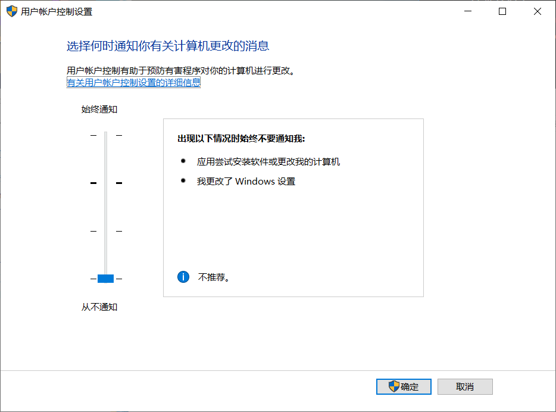
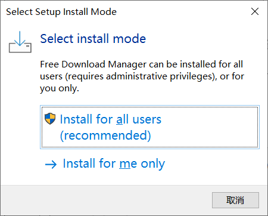
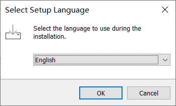
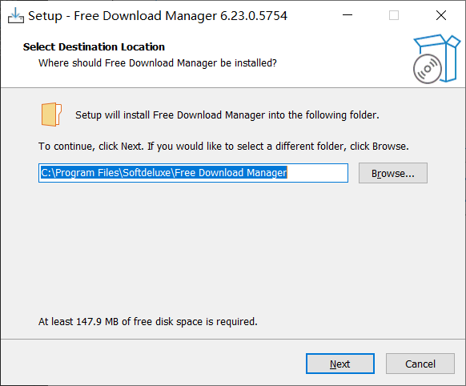
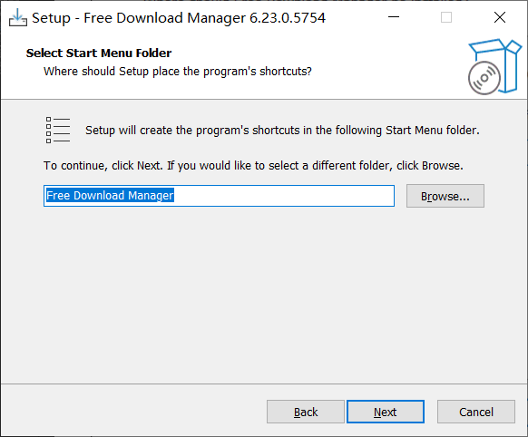
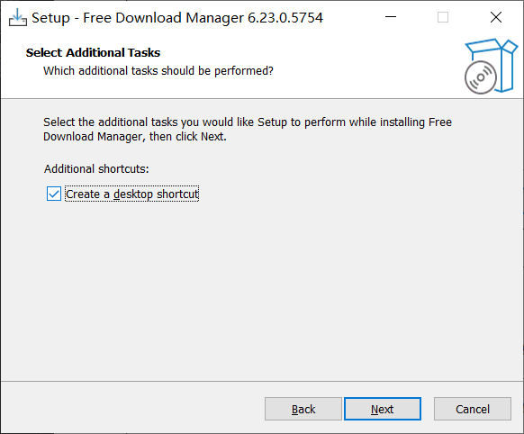
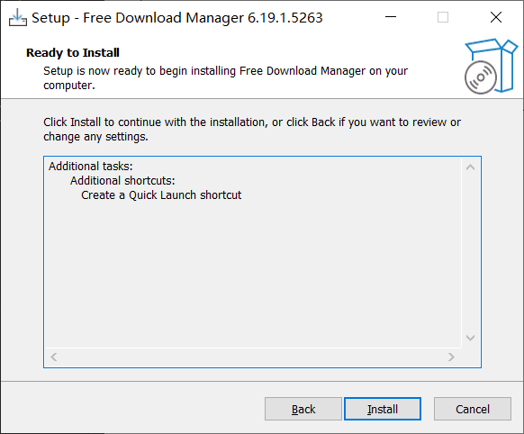
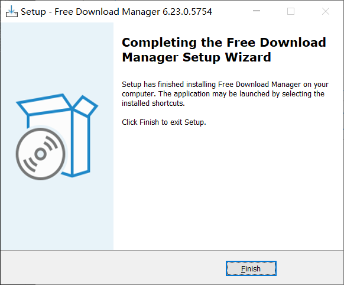

# 下载与安装
*这应该是大部分人最头疼的地方吧*
**为什么要在电脑安装各类软件？**
原因有：

1. **获取特定功能**：一些软件提供了电脑自带的程序没有的功能，如图像编辑、视频编辑等。
2. **提高工作效率**：办公软件和生产力工具可以帮助更高效地完成任务。
3. **游戏和娱乐**：高质量的游戏和娱乐软件需要本地安装才能运行。
4. **离线使用**：某些软件需要在没有网络连接时使用，如文档处理工具。
5. **更好的性能**：本地安装的软件通常比在线应用程序运行更快、更稳定。
6. **数据隐私和安全**：本地软件可以保护用户数据，不需担心数据传输和存储安全问题。
7. **专业需求**：某些专业软件需要在本地安装，以满足特定工作要求。

这些原因让人们选择在电脑上下载安装软件，以满足不同的需求和场景。
## 下载软件
有的电脑会自带一个应用商城、360软件安装助手这类的软件，如果你真的没有信息获取的能力，请在这里下载
我要推荐的是找寻软件的官网去下载软件
## 下载工具
***不推荐：迅雷 原因：广告多，bt吸血***
可以使用idm，fdm等下载工具，这里推荐fdm，因为它有和各个浏览器兼容的扩展选项，可以替代原版浏览器中下载功能，并且支持分片下载和断点续传，很方便。
> FDM下载地址:<https://www.freedownloadmanager.org/zh/download.htm>
## 安装软件
这里在win10或11中会在安装软件时候弹出一个对话框，很是烦人，这里提供一个解决方法
- 打开‘控制面板’（win+r 对话框输入control）
- 点击‘系统和安全’，在安全和维护下面点击‘更改用户账户设置’
- 在弹出的窗口中调成‘从不通知’后点击确定

浏览器下载的文件一般默认安装在你 此电脑-下载 中，以后如果找不到安装程序，可以在这里找到。
> **切记，你下载的只是安装程序，就像你手机的应用安装包一样，可以删除掉，不会影响你原本程序的使用。除了那些解压了没有安装程序的文件除外**

安装的英文通常为`setup` `install`等，后缀名为`.exe`
#### 

- 双击安装程序，弹出窗口选择第一个（为所有用户安装）

- 安装语言选择english 点ok

- 这里会让你选择安装路径，默认会安装在c盘，这里要点击`browse`选择一个除了c盘外的路径，并且文件夹名字最好是全英文。
可以直接复制以下路径，会自动创建以下文件夹
> D:\download\fdm

- 该程序要创建快速启动，这里就next

- 创建桌面快捷方式，我没勾选

- 点击install

- 点击finish

安装完后自动弹出应用程序，如果界面全英文可以在左上角设置中把语言调成chinese。在浏览器集成中可以安装以下支持的浏览器，之后会自动拦截浏览器所有下载

使用fdm会在每次下载都会询问安装路径和文件名，这个可以更改不询问直接安装。

好啦，上述的下载安装过程你是否理解了呢，那么请综合应用，安装****steam****吧😏