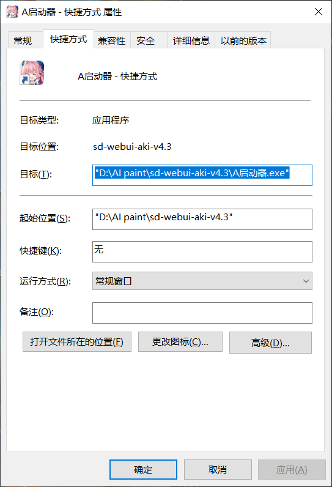
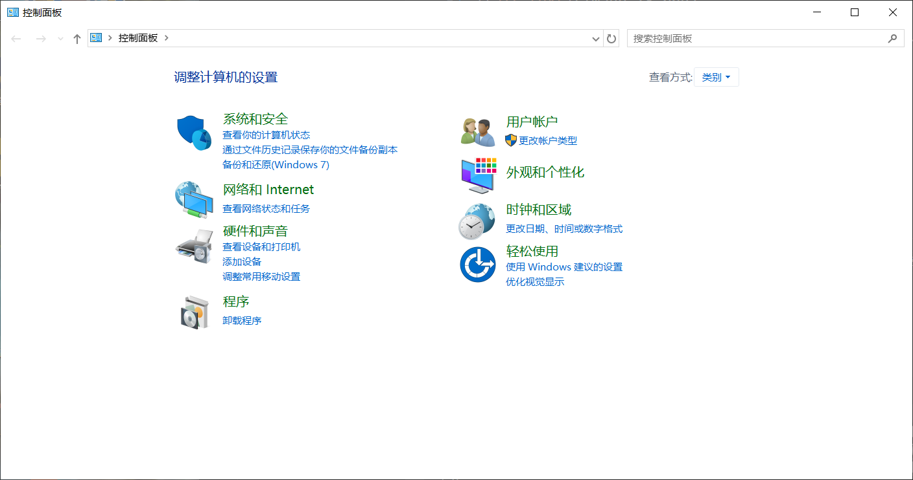
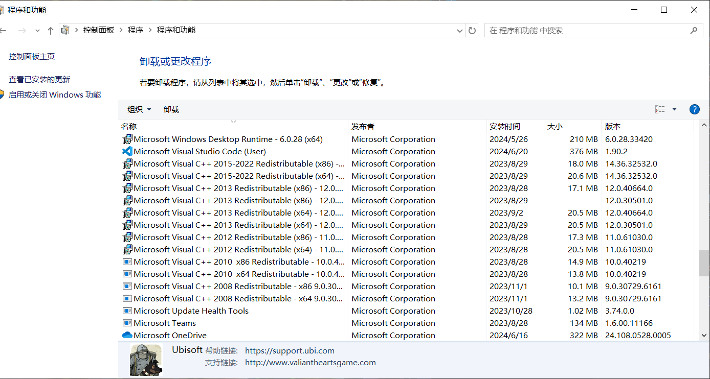

# 卸载
在手机上卸载方式是长按软件图标，拖动或者点击删除删除掉。那电脑上以同样的方式删除，把图标拖到回收站并清空？
**这样是不对的**
因为你删除的只是快捷方式

像这样左下角带有小箭头的表示此图标是快捷方式，其作用是打开目标位置的.exe文件，你可以右键该图标——属性，查看这个图标指向的位置

***删掉快捷方式会对程序运行有影响吗？***
对程序没有，对你可能有，因为你找不到了。无需担心快捷方式占用磁盘空间，它只有1kb。

## 正确卸载应用
- 从控制面板卸载
1. 打开你的控制面板（如果你按照我之前提供的方式，桌面上会有一个控制面板的图标，双击即可）win+r 输入 control并回车
2. 在以下界面点击卸载程序 

找到你要卸载的软件，左键单击后右键单击并按卸载
之后控制面板会去找对应程序的卸载程序（uninstall.exe），你一路按确定就行了
***请不要卸载的***

或者你显卡驱动等程序，会导致你电脑出现问题

- 直接删除程序文件
1. 找到程序所在位置或右键快捷方式打开对应位置
2. ctrl+a shift+del
**这种方式只适用于没有卸载程序开箱即用的应用**
- 使用软件管家进行卸载

 

以上的方式可能不会完整删除，会有垃圾与注册表残留,可能会导致重新安装时候出现问题。推荐使用Geek
这里放出官网<https://geekuninstaller.com/download>
*FREE*是免费的意思