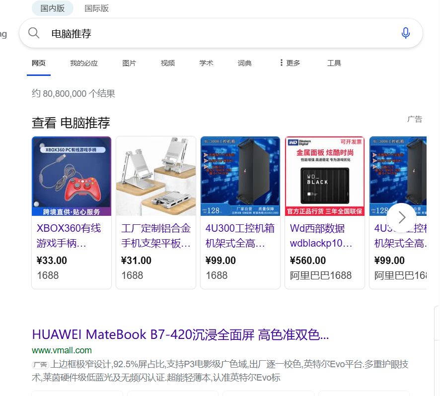
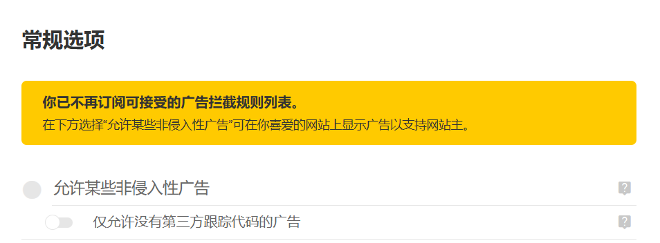
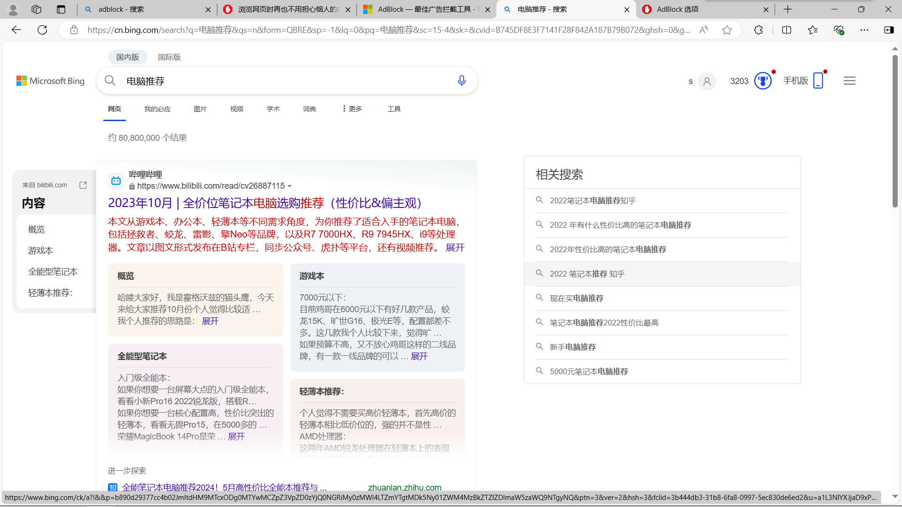
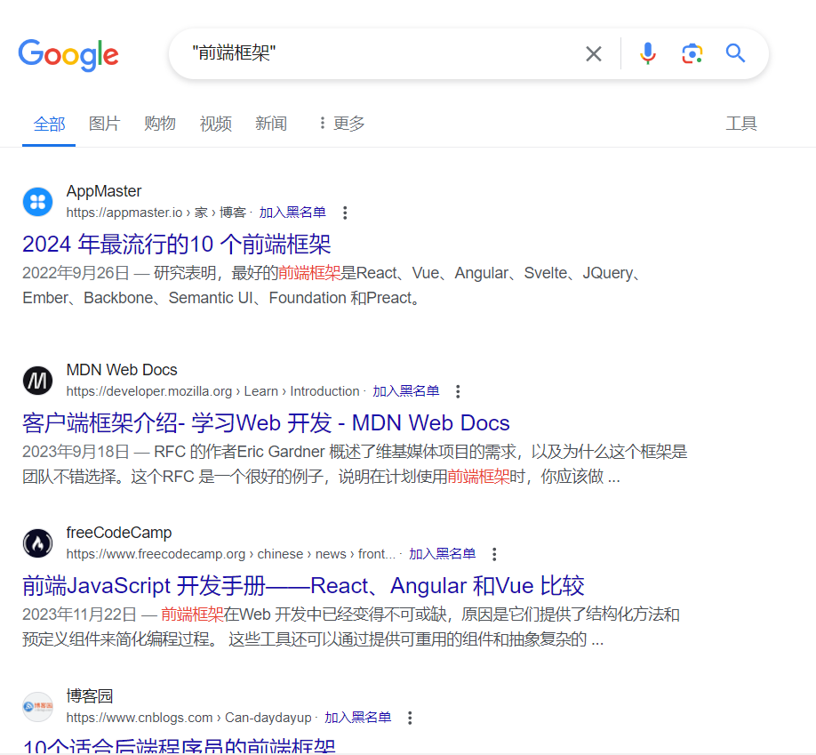
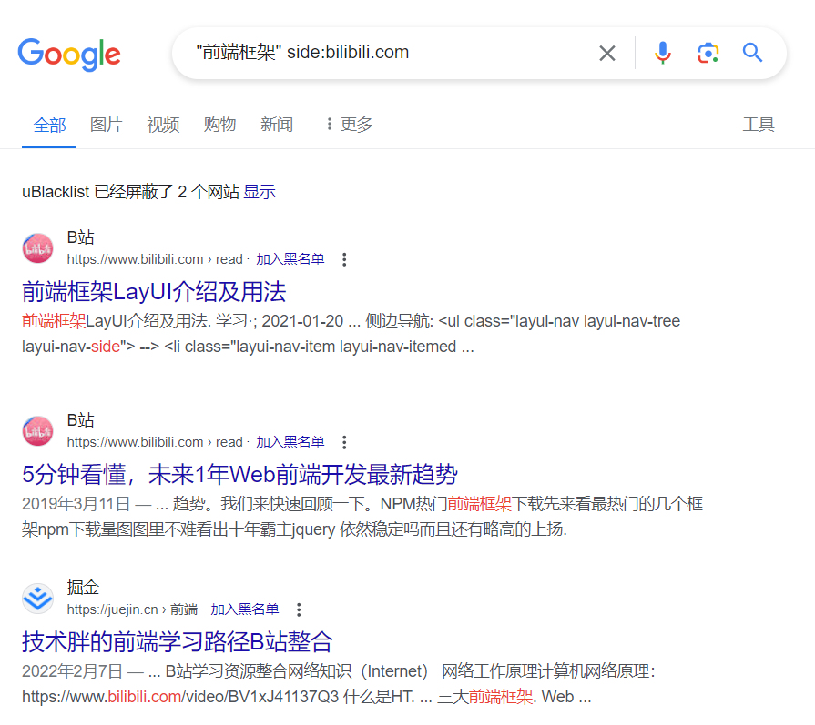
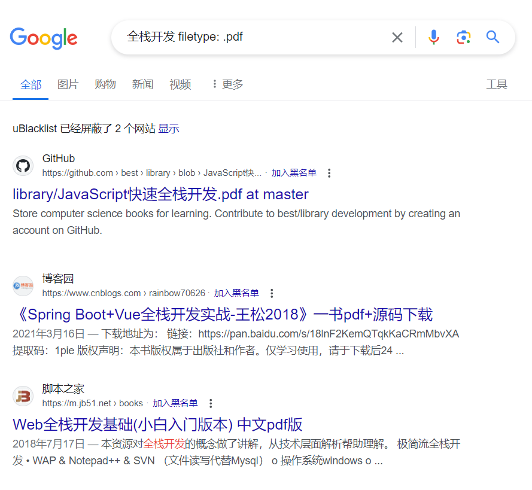
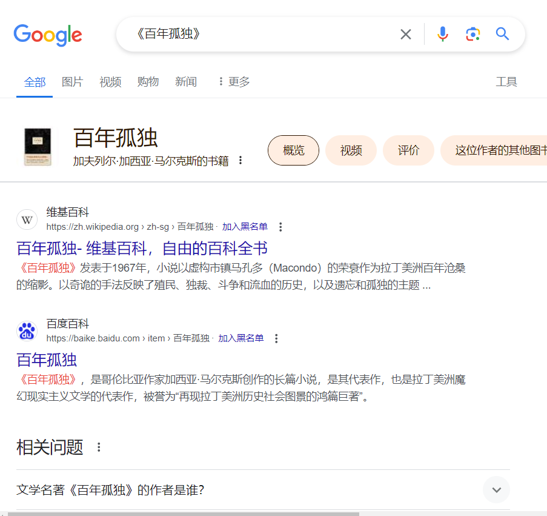

# 搜索引擎

每个浏览器会自带一个默认的搜索引擎，edge自带bing，chrome自带google，国内的搜索引擎大多是baidu，
要我说，按照信息搜索准确度、全面度评价的话
**Google > bing > baidu**
google的主要使用语言是英语，对此，查各类文献以及相关专业知识方便快捷，当然中文搜索也很好用。bing是将搜索引擎分成了国内版和国外版。而Baidu，信息准确度不是很理想，原因在于它总是推荐自家产品和大量广告，使得许多人难以分辨信息的真假从而上当。

## 关闭广告
广告对于搜索引擎厂商是一个盈利点，但对于用户来说无法快速得到准确信息，但可以用浏览器中扩展程序来屏蔽（以adblock为例）
***edge***
1. 在搜索引擎中搜索adblock plus 或在地址栏输入以下网址 <https://getadblock.com/zh_CN/>
2. 点击 获取edge版本的adblock plus 之后会跳转到微软商城，点击获取按钮
3. 在弹出的提示框点击 ‘添加拓展’
4. 之后会弹出捐款提示框，有能力的建议支持一下。关闭该窗口能正常使用拦截广告的功能
我们来试一下效果，输入电脑推荐试试

怎么都是广告，哦，得去设置关掉这个选项
扩展——更多操作——扩展选项——关掉‘允许非入侵广告’

再让我们试一下，广告消失了

**以上的操作能够极大提升你搜索信息的效率，减少上当受骗的可能**

## 信息检索
近些年的国内，使用搜索引擎快速检索信息越发困难，大家都在做私域，比如微信公众号，你使用搜索引擎是搜不到里面任何内容的，这就需要去对应平台找到你需要的信息，所以你必须对多个平台的领域有所了解，知道它们在哪，怎么找。
国外大多以开源精神为主，搜索引擎能满足你绝大部分需要——前提你的会英语
这里提供一些精准搜索信息的技巧*以下标点符号都是英文的*
1. 精准搜索 `""`在你搜索的关键词加上双引号，精准匹配标题与文章关键字

2. 站内搜索 `side:` 用法是在后面加上去掉`https://www.`的网址

3. 文档搜索 `filetype` 用于搜索特定文件格式

4. `《》` 搜索书籍著作

详细的可以看这位大佬<https://www.cnblogs.com/liuzhongkun/p/15647486.html>
以上的这些功能有位大佬做了可视化界面，方便搜索
<https://bestming.github.io/search_tools/>
信息是主动搜索来的，前期问题会遇到非常多，不要气馁，多多尝试

## AIChat
近期大火的人工智能极大简化了信息搜索的难度。通过与AI对话，用户能够轻松获取所需信息，这对信息搜索有很大的帮助。然而，需注意信息的真伪性。有时，AI遇到自己不熟悉的内容时会编造答案。此外，不联网的AI仅基于特定时间的数据库，其回答可能会有些滞后。对于小白来说，使用AI进行初步了解某一领域的知识点框架还是非常有帮助的。

**使用方式推荐：**
- 可以向AI提问某个知识点或关键词，以获取相关信息。

### AI工具推荐
[ChatGPT](https://chatgpt.com/)
[智普清言](https://chatglm.cn/)
[天工](https://www.tiangong.cn/)
