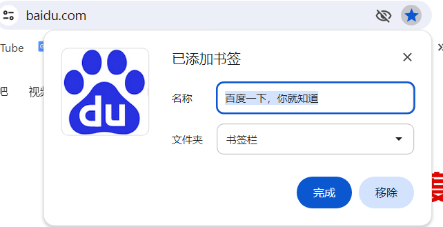

# 浏览器
浏览器（Web Browser）是一种软件应用程序，它允许用户访问和浏览万维网（World Wide Web）上的信息。用户通过浏览器可以查看网页、文字、图片、视频和音频等多媒体内容

常见的浏览器有：
- Google Chrome
- Mozilla Firefox
- Microsoft Edge
- Apple Safari

在你的win系统中会自带Microsoft Edge，图标长得像小写e，双击它即可进入。但是由于国内版做的主页界面囊肿，所以需要调整一些界面来做到简约
- 点击主页左上角的小齿轮（页面设置）
- 关闭 '快速链接' '网站导航' '信息摘要'

这下子你的浏览器界面应该只剩顶部的地址栏和搜索框了
**地址栏**：用于输入网站网址，敲击回车即可跳转，同时也有搜索引擎的功能
比如尝试输入
>www.baidu.com

如果你认为微软自带的浏览器用不习惯，可以试试Google Chrome，请无视Edge各种提示
>下载链接 https://google.cn/chrome/

## 更改浏览器主页
如果你发现你的浏览器搜索引擎无法使用或者不喜欢这个搜索引擎作为主页，我将会讲解如何更换浏览器主页
 **在edge中**
- 点击浏览器右上角横向三个点，在下拉菜单中点击 ‘设置’
- 在弹出的窗口左侧导航栏点击‘开始、主页和新建标签页’
- 在‘edge启动时’下面选择‘打开以下页面’-‘添加新页面’
- 输入url，比如 `www.baidu.com `

**在chrome中**
- 点击浏览器右上角竖向三个点，在下拉菜单中点击 ‘设置’
- 在左侧的导航栏选择‘启动时’
- 选择‘打开特定网页或一组网页’ - ‘添加新网页’
- 输入url，比如`www.bing.com`
可以直接修改搜索引擎 点 `搜索引擎`在Google右侧点击`更改`按钮

## 收藏网址
一个网址对你来说经常使用，但又不想每次用到都要输入网址或查询，使用浏览器中‘收藏’功能，点击即可打开收藏的网址，一般这个图标都是地址栏中的星星图标。
没有收藏的样式

点击空心星星即可添加到收藏夹内

可以点击文件夹进行分类
之后再要浏览点击浏览器右上角‘书签栏’或‘收藏栏’找到你放在的位置即可