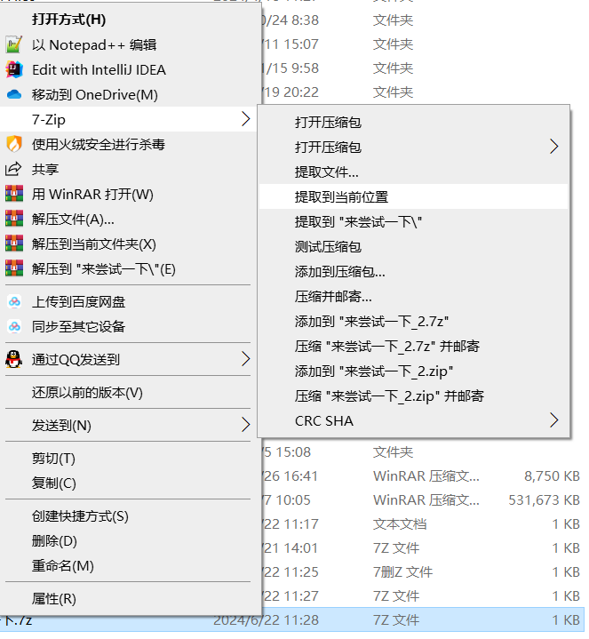
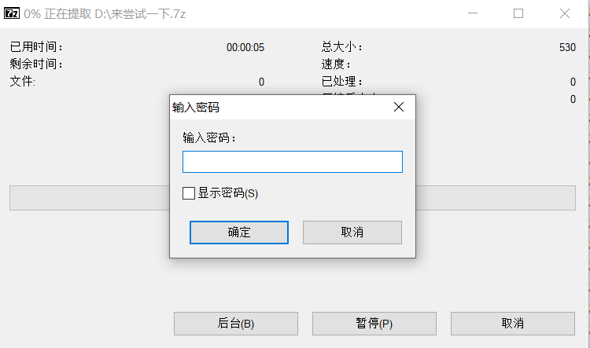
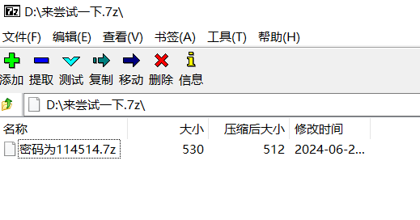
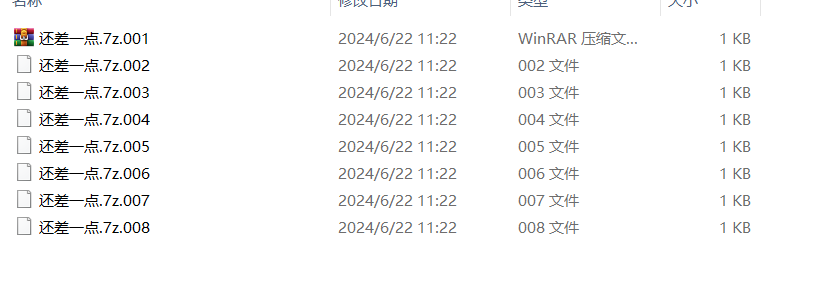

# 解压
## 为什么要压缩文件
压缩文件在传输前可以减少文件大小、提高传输速度、降低成本、提高可靠性、便于管理和增加安全性。因此，压缩是文件传输中的一个重要步骤，尤其在网络带宽有限或需要传输大量文件时显得尤为重要，也有为了规避审核的需要。
## 常见的压缩格式
- 7z
- zip
- rar

## 解压文件
这里我做了一个压缩文件供大家练习
[点我下载](/来尝试一下.7z)
接下来我会按照这个文件讲解如何解压
***前置条件：打开文件管理器中‘文件拓展名’并下载了7z或bandzip解压工具***

1. 左键点击该文件选中，右键点击，在弹出的菜单栏中选择7-zip——提取到当前位置

2. 弹出以下窗口

**我怎么知道密码是什么？**
一般密码会在提供者的网站会标明密码，也有可能放在文件名中或被压缩文件中。
这里用7z打开压缩包，会发现密码在压缩文件名上

3. 回到刚才的窗口，输入密码
4. 这时在你的文件夹中多出了一个后缀名为.7删z的文件，我们需要修改后缀名让文件可以解压（貌似不改也能识别）  左键单击选中文件，右键点击——重命名，删掉后缀名中‘删’字，回车并确定
5. 解压成功后会发现多出了‘加油’的文件夹，双击点进去，靠这啥呀

文件名中带有 .001、.002 等字样通常表示这些文件是一个被分割的大文件的一部分。解压其文件只需要将这些文件放在同一个文件夹内，并右键单击.001文件，选择解压到或提取当前位置
6. 成功的话，你当前文件夹内会多出一个叫‘恭喜你.txt’文件，点开它吧