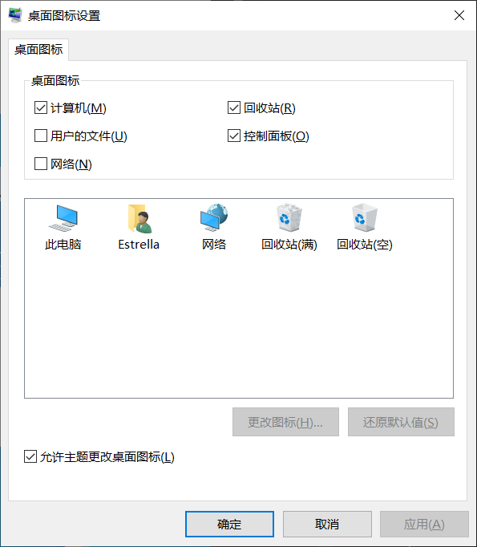
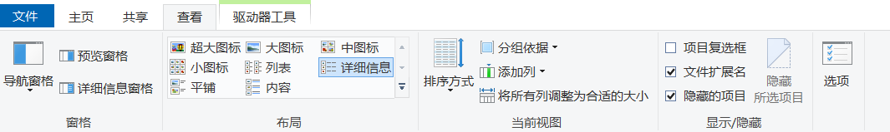

# 此电脑

在桌面上有一个像计算机的图标，它是 Windows 系统的资源管理器，你在电脑上的所有数据文件都会显示在这里。如果在你的桌面上不显示这个图标，可以进行以下操作来显示：

1. 右键点击桌面空白处，在弹出的菜单栏选择“个性化”。
2. 在弹出的窗口左侧选择“主题”。
3. 点击“桌面图标设置”。
4. 在弹出的窗口中勾选“计算机”（建议也把“回收站”和“控制面板”勾选上）。
5. 点击应用并关闭窗口。

## 设备与驱动器

双击进入“此电脑”，在弹出的窗口中你可以看到两个驱动器：
- 系统 (C:)
- (D:)

C盘中存放的是计算机系统文件，如果删除了其中类似于 .dll 的文件，系统将无法运行，只能重新安装系统。

分盘的意义在于让用户程序和系统互不干扰，尽量把用户使用的应用或文件存放在除了 C 盘以外的盘中。如果 C 盘容量不足，会导致开机速度缓慢和电脑卡顿等情况。因此，在使用计算机时考虑分盘，推荐 C 盘最小容量为 120GB。

## 分盘分区

默认情况下，笔记本厂商会将一个磁盘对半分成两个分区。如果我们想把 C 盘多余的空间分给其他盘，可以采用以下方法：
- 使用系统中的“磁盘管理” (`Win+X` 功能)。
- 使用分区软件（如 DiskGenius 等，推荐）。

## 显示容量不符

细心的人会发现，为什么在我买电脑的配置明明写的是 512GB/1TB，在电脑中显示就少了呢？这绝不是虚假宣传，原因在于操作系统与硬盘厂商对硬盘的计算标准不同导致的。

操作系统采用的是二进制计算：
- 1TB = 1024GB = 1,048,576MB

硬盘厂商采用的是十进制计算：
- 1TB = 1000GB = 1,000,000MB

计算方法：
- 1000^3 / 1024^3 ≈ 0.93132 (保留五位小数)
- 所以显示的容量为 1000GB * 0.93132 ≈ 931.32GB

当然，有些厂商会将 1TB = 1024GB，那么容量为 953.67GB。如果少于这个数，可以考虑磁盘是否为伪劣产品。

## 移动新内容保存位置

在系统默认设置中，所有文件安装的初始目录都会在 C 盘，这会导致 C 盘的容量不足。为了解决这个问题，我们要将“此电脑”中上面的几个文件夹存储位置进行修改：

1. `Win+X` 点击“设置”，在弹出的窗口左侧找到“存储”。
2. 在该页面下方找到“更改新内容的保存位置”。
3. 把所有的路径更改为除了 C 盘以外的盘。

我觉得这样移动未能满足我的要求，而且我的源文件夹内已有内容。我直接修改每个文件夹的属性保存位置，可以自行尝试。

## 文件夹设置

在顶部选项卡中——查看，可以选择文件夹图标大小和显示信息。我推荐这样设置：

- 勾选“文件扩展名”与“隐藏的项目”。

#### 文件扩展名：
用于系统识别文件以什么方式打开它。

#### 隐藏的项目：
在系统中被设置为不可见文件，可以调整文件属性取消不可见，反之亦然。

> 在 Win11 中的设置：https://www.pconline.com.cn/win11/1477/14779490.html

---

